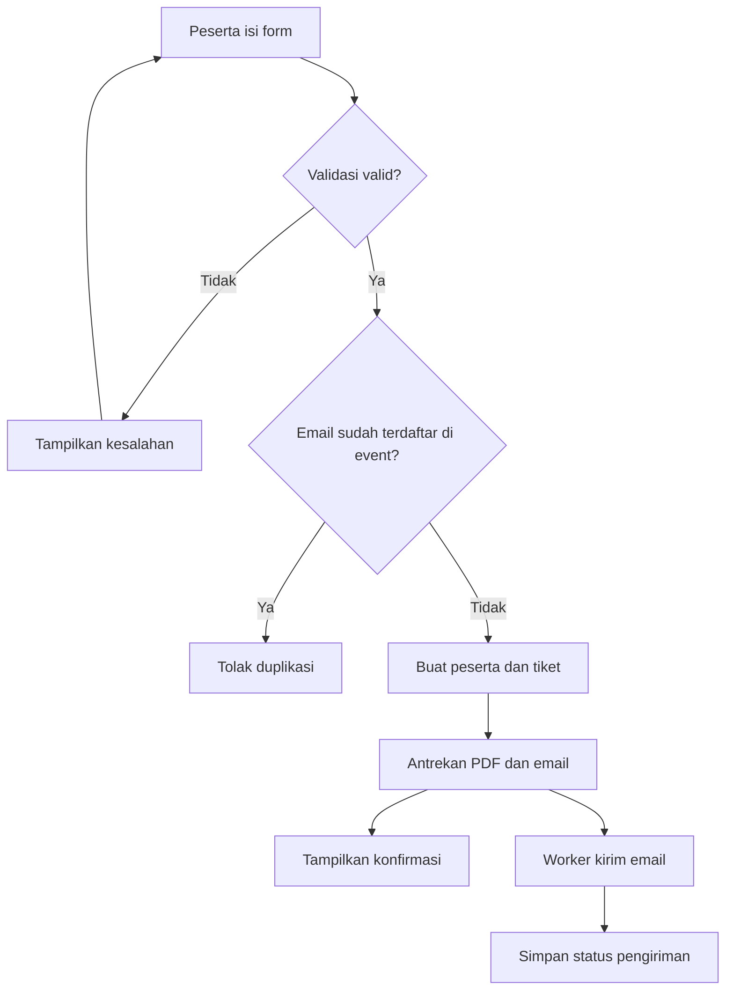
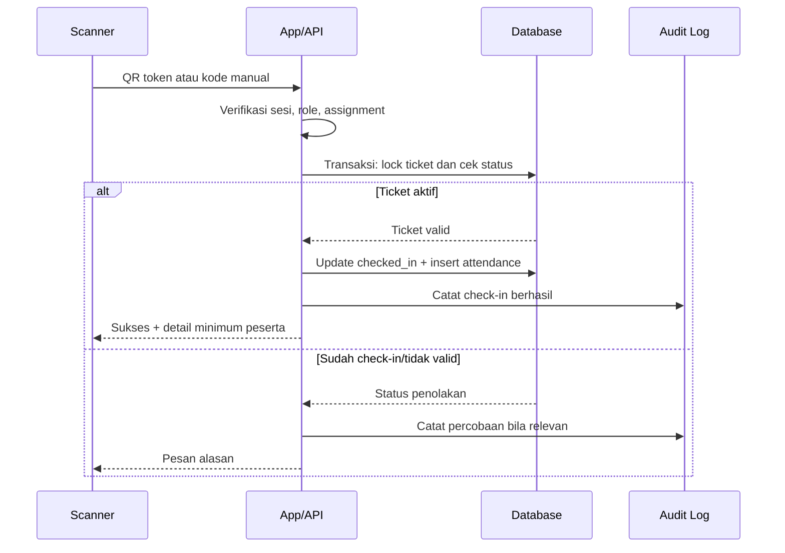
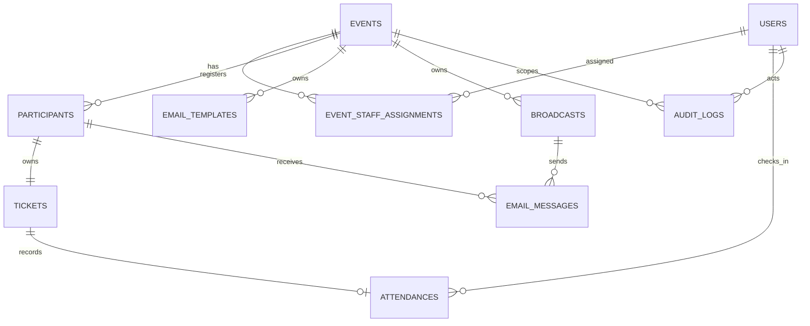
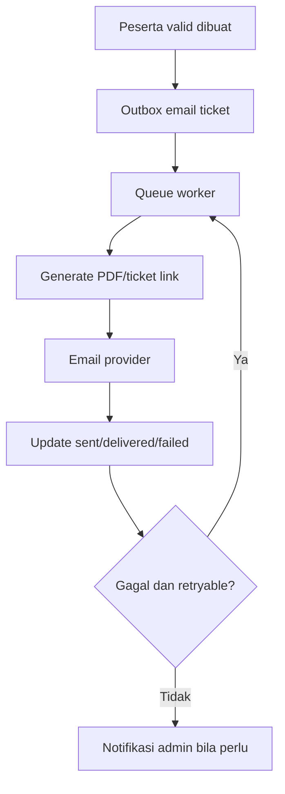
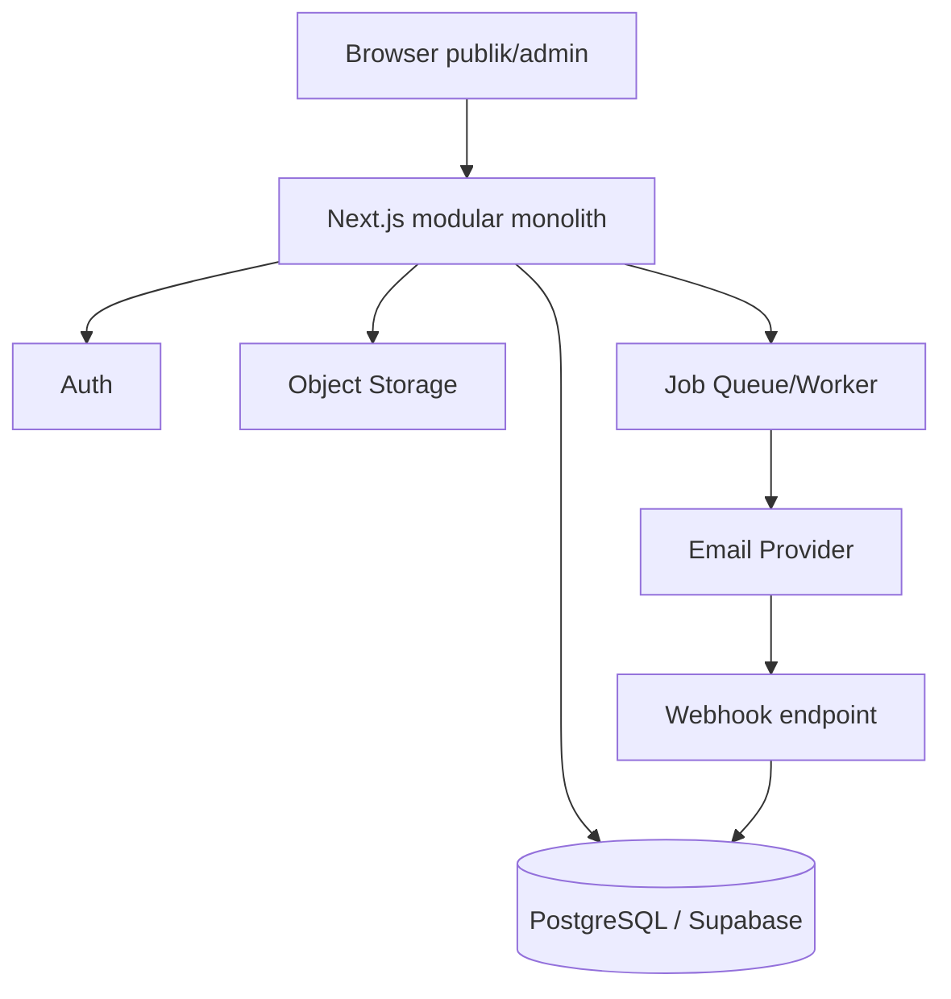

# Software Blueprint — Event Management System dengan QR Code Check-in

Versi 1.0 · 17 Juli 2026 · Status: siap menjadi acuan implementasi

## 1. Product Vision

Menyediakan platform event umum yang menyatukan registrasi, penerbitan E-Ticket, komunikasi email, dan validasi kehadiran QR secara aman, cepat, serta dapat diaudit. Produk harus dapat dimulai dengan biaya rendah dan berkembang tanpa mengubah aturan bisnis inti.

## 2. Product Requirement Document (PRD)

### Sasaran

- Mengurangi pekerjaan manual panitia dari registrasi sampai pelaporan pasca-acara.
- Menjamin satu tiket aktif hanya dapat menghasilkan satu check-in.
- Membuat status peserta, tiket, email, dan kehadiran mudah ditelusuri.

### Ruang lingkup MVP

Autentikasi admin, empat role, event, registrasi publik, input manual, import CSV/XLSX, tiket QR dan kode manual, PDF E-Ticket, email antrean, broadcast, scanner, attendance, pencarian/filter, export, dashboard, dan audit log.

### Bukan ruang lingkup MVP

Pembayaran, kursi bernomor, registrasi kelompok, aplikasi native, SMS/WhatsApp, sertifikat otomatis, badge printing, dan biometrik. Semua dapat ditambah sebagai modul baru setelah inti stabil.

### Keberhasilan

- Peserta valid selalu mendapat tiket unik.
- Validasi check-in normal selesai ≤3 detik pada jaringan stabil.
- Tidak terjadi check-in ganda pada tiket yang sama.
- Pengiriman email dapat dipantau dan dikirim ulang.

## 3. Functional Requirements

| ID | Kebutuhan fungsional | Aktor |
|---|---|---|
| FR-01 | Login, logout, lupa/reset kata sandi, dan manajemen sesi admin. | Semua admin |
| FR-02 | Membuat, mengubah, menerbitkan, menutup, mengarsipkan event. | Super Admin, Admin Event sesuai assignment |
| FR-03 | Menetapkan Admin Event, Admin Registrasi, dan Admin Scanner ke event. | Super Admin; Admin Event untuk tim event-nya |
| FR-04 | Menyediakan halaman registrasi publik unik per event. | Tamu |
| FR-05 | Menambah/edit/membatalkan/mengaktifkan kembali peserta. | Super Admin, Admin Event, Admin Registrasi |
| FR-06 | Import peserta dengan template, pemetaan kolom, preview, dan laporan error per baris. | Super Admin, Admin Event, Admin Registrasi |
| FR-07 | Membuat Guest ID, token QR, kode check-in, dan E-Ticket setelah peserta lolos validasi. | Sistem |
| FR-08 | Mengantrekan email tiket, menyimpan status, dan mendukung kirim ulang. | Sistem; admin berizin |
| FR-09 | Mengelola template dan mengirim broadcast bersegmentasi. | Super Admin, Admin Event |
| FR-10 | Memindai QR atau memasukkan kode manual untuk check-in. | Admin Event, Admin Scanner berizin |
| FR-11 | Menampilkan pencarian/filter peserta, tiket, email, dan attendance. | Berdasarkan role |
| FR-12 | Mengekspor data tersaring ke XLSX/CSV dan PDF. | Super Admin, Admin Event |
| FR-13 | Menyediakan dashboard global dan per-event. | Berdasarkan role |
| FR-14 | Merekam audit aktivitas kritis. | Sistem; dibaca admin berizin |

### Field registrasi standar

`full_name*`, `email*`, `phone_number*`, `organization`, `job_title`, `privacy_consent*`. Sumber data (`public_form`, `manual_admin`, `import`) tidak mengubah struktur ini. Field tambahan event boleh dibuat kemudian melalui modul form builder; MVP memakai field standar agar import dan laporan tetap konsisten.

### Status inti

| Objek | Status |
|---|---|
| Event | draft, published, registration_closed, completed, archived, cancelled |
| Peserta/tiket | active, checked_in, cancelled, disabled |
| Email | queued, sending, sent, delivered, failed, bounced, skipped |
| Broadcast | draft, scheduled, sending, completed, partially_failed, cancelled |

## 4. Non-Functional Requirements

| Area | Ketentuan |
|---|---|
| Kinerja | Halaman daftar dan scanner responsif; API p95 ≤ 1,5 detik kecuali export/generate PDF. |
| Ketersediaan | Target MVP 99,5% bulanan; proses email tidak boleh menghambat registrasi. |
| Keamanan | TLS, RBAC + event assignment, RLS database, token QR acak, audit log. |
| Skalabilitas | Modul stateless; job asynchronous; pagination; index database; object storage. |
| Integritas | Check-in atomik, constraint unik, idempotensi job dan webhook. |
| Aksesibilitas | Kontras memadai, navigasi keyboard, pesan error jelas, desain responsif. |
| Privasi | Minimasi data, consent, akses terbatas, retensi dan penghapusan terkontrol. |
| Observability | Log terstruktur, error tracking, metrik job/email/check-in, alert. |

## 5. Business Rules

1. Satu record peserta berlaku untuk satu event; orang yang hadir pada dua event memiliki dua record dan dua tiket.
2. `guest_id`, `qr_token`, dan `checkin_code` wajib unik dalam cakupan event. QR menyimpan token aman, bukan data pribadi.
3. Email duplikat dalam event ditolak secara default. Admin Event dapat memilih kebijakan khusus hanya bila fitur itu kelak ditambahkan; MVP tidak membuat pengecualian.
4. Tiket hanya dibuat untuk peserta valid dan event yang menerima registrasi.
5. Peserta berstatus `cancelled` atau `disabled` tidak dapat check-in dan tidak menerima email tiket baru.
6. Check-in sukses mengubah tiket dari `active` menjadi `checked_in` dalam satu transaksi. Percobaan berikutnya mengembalikan status already checked-in tanpa membuat attendance kedua.
7. Admin Scanner hanya dapat check-in pada event assignment-nya; input manual memerlukan izin `manual_checkin`.
8. Edit data peserta tidak mengganti token QR/kode kecuali admin melakukan tindakan eksplisit regenerasi tiket; regenerasi menonaktifkan token lama.
9. Import memiliki fase upload → mapping → validasi → preview → konfirmasi. Tidak ada insert parsial tanpa laporan hasil yang jelas.
10. Email transactional dan broadcast masuk antrean; retry terbatas dengan backoff. Status penerima disimpan per pesan.
11. Penghapusan data operasional memakai soft delete/cancel agar audit tetap utuh; penghapusan permanen mengikuti kebijakan retensi.
12. Export mengikuti filter aktif dan hak akses pengguna; tautan download bersifat sementara dan terlindungi.

## 6. User Roles dan Matriks Akses

| Kemampuan | Super Admin | Admin Event | Admin Registrasi | Admin Scanner |
|---|:---:|:---:|:---:|:---:|
| Seluruh event/akun/pengaturan | Ya | Tidak | Tidak | Tidak |
| Event yang ditugaskan | Ya | Kelola | Lihat konteks | Lihat konteks |
| Peserta | Semua | Kelola event | Kelola event | Lihat minimum |
| Input/import peserta | Ya | Ya | Ya | Tidak |
| Kirim ulang tiket/status email | Ya | Ya | Ya | Tidak |
| Template/broadcast | Ya | Kelola event | Tidak | Tidak |
| Tim scanner/registrasi | Ya | Kelola event | Tidak | Tidak |
| Scan QR | Ya | Ya | Tidak | Ya |
| Kode manual | Ya | Ya | Tidak | Jika diizinkan |
| Laporan/export | Semua | Event sendiri | Lihat operasional terbatas | Tidak |
| Audit log | Semua | Event sendiri | Tidak | Tidak |

Semua izin selain Super Admin mensyaratkan assignment event. Role tidak otomatis memberi akses lintas event.

## 7. User Journey

### Registrasi publik

Tamu membuka link event → melihat detail → mengisi form dan consent → sistem memvalidasi → record peserta dan tiket dibuat → pekerjaan email diantrekan → halaman sukses menampilkan email tersamarkan → peserta menerima tiket.

### Registrasi oleh panitia

Admin Registrasi memilih event → input manual atau upload file → memperbaiki error validasi bila ada → konfirmasi proses → sistem membuat tiket per peserta sukses → admin memantau email dan dapat resend.

### Check-in

Petugas login → memilih event assignment → scan QR / ketik kode → server memvalidasi token, status, dan assignment → transaksi check-in atomik → layar hijau sukses atau pesan sudah check-in/tidak valid/dibatalkan → audit dan attendance tersimpan.

### Broadcast

Admin Event membuat kampanye → memilih segmen → menyusun template dan preview → kirim sekarang/jadwalkan → job mengirim bertahap → dashboard menampilkan status per penerima.

## 8. Use Cases

| Use case | Aktor | Hasil |
|---|---|---|
| UC-01 Membuat event | Super Admin/Admin Event | Event draft dan link registrasi siap setelah dipublikasikan. |
| UC-02 Registrasi publik | Tamu | Peserta/tiket dibuat dan email diantrekan. |
| UC-03 Import peserta | Admin Registrasi | Peserta valid dibuat; baris gagal tersedia untuk koreksi. |
| UC-04 Kirim ulang tiket | Admin Registrasi | Email ticket job baru dibuat secara terlacak. |
| UC-05 Scan check-in | Admin Scanner | Attendance tunggal tercatat atau alasan penolakan ditampilkan. |
| UC-06 Broadcast | Admin Event | Kampanye berjalan sesuai segmen dengan log penerima. |
| UC-07 Audit aktivitas | Super Admin/Admin Event | Aktivitas sesuai lingkup dapat dicari dan diperiksa. |

## 9. Activity Diagram — Registrasi dan Tiket



## 10. Sequence Diagram — QR Check-in



## 11. Entity Relationship Diagram (ERD)



## 12. Database Design

### Tabel utama

| Tabel | Kolom inti |
|---|---|
| users | id, full_name, email, password/auth_provider_id, role, status, last_login_at, created_at |
| events | id, slug, name, description, start_at, end_at, venue, capacity, status, registration_open_at, registration_close_at, created_by |
| event_staff_assignments | id, event_id, user_id, role, manual_checkin_allowed, assigned_by, assigned_at |
| participants | id, event_id, full_name, email_normalized, phone_number, organization, job_title, privacy_consent_at, registration_source, status, registered_at |
| tickets | id, event_id, participant_id, guest_id, qr_token_hash, checkin_code_hash, ticket_status, qr_version, issued_at, disabled_at |
| attendances | id, event_id, participant_id, ticket_id, checked_in_at, method, checked_in_by, device_label |
| email_templates | id, event_id nullable, type, name, subject, body, is_active, updated_by |
| email_messages | id, event_id, participant_id nullable, broadcast_id nullable, template_id nullable, message_type, recipient_email, status, provider_message_id, attempt_count, queued_at, sent_at, delivered_at, failed_at, failure_reason |
| broadcasts | id, event_id, name, subject, body_snapshot, audience_rule, status, scheduled_at, created_by |
| import_jobs | id, event_id, file_name, initiated_by, status, total_rows, valid_rows, invalid_rows, processed_rows, error_file_path |
| export_jobs | id, event_id nullable, type, filters_snapshot, requested_by, status, file_path, expires_at |
| audit_logs | id, event_id nullable, actor_user_id nullable, action, entity_type, entity_id, before_data, after_data, ip_hash, user_agent, created_at |

### Constraint dan index wajib

- `events.slug` unik.
- `participants (event_id, email_normalized)` unik untuk peserta aktif/non-terhapus.
- `tickets.guest_id` unik; token QR dan kode manual disimpan dalam bentuk hash dan diberi unique index sesuai strategi token lookup.
- `tickets.participant_id` unik.
- `attendances.ticket_id` unik: ini adalah garis pertahanan database terhadap check-in ganda.
- Index: participants(event_id, registered_at), participants(event_id, status), tickets(event_id, ticket_status), attendances(event_id, checked_in_at), email_messages(event_id, status), audit_logs(event_id, created_at).

### Abstraksi penyimpanan

Business layer memakai interface repository (`EventRepository`, `ParticipantRepository`, `TicketRepository`, dan seterusnya). Implementasi awal boleh `GoogleSheetsRepository` untuk MVP, lalu diganti `PostgresRepository`/Supabase tanpa mengubah use case. Google Sheets tidak direkomendasikan untuk concurrency scanner tinggi; produksi memakai PostgreSQL.

## 13. Folder Structure

```text
event-management-system/
├── app/                       # routing, pages, API entry points
├── src/
│   ├── domain/                 # entities, value objects, business rules
│   ├── application/            # use cases, DTOs, ports/interfaces
│   ├── infrastructure/         # Supabase/Postgres, email, PDF, queue, storage
│   ├── presentation/           # UI components, view models, validation
│   ├── modules/
│   │   ├── auth/ events/ participants/ tickets/
│   │   ├── attendance/ emails/ broadcasts/ reports/ audit/
│   ├── shared/                 # errors, result type, utilities, config
│   └── jobs/                   # email, PDF, import, export workers
├── tests/                      # unit, integration, e2e
├── docs/                       # ADR, API, operational notes
└── database/                   # migrations, seed, RLS policies
```

Rekomendasi: modular monolith dalam satu repository dan satu deployable aplikasi. Hindari microservices pada MVP; kompleksitasnya tidak sebanding dengan manfaat awal.

## 14. API Design

Gunakan REST JSON, versioning `/api/v1`, validasi server-side, pagination cursor/offset, dan respons error standar.

| Area | Endpoint utama |
|---|---|
| Auth | `POST /auth/login`, `POST /auth/logout`, `POST /auth/forgot-password`, `POST /auth/reset-password`, `GET /auth/me` |
| Events | `GET/POST /events`, `GET/PATCH /events/:id`, `POST /events/:id/publish`, `POST /events/:id/assignments` |
| Public | `GET /public/events/:slug`, `POST /public/events/:slug/registrations` |
| Participants | `GET/POST /events/:id/participants`, `GET/PATCH /participants/:id`, `POST /participants/:id/cancel`, `POST /participants/:id/reactivate` |
| Import | `POST /events/:id/imports`, `POST /imports/:id/validate`, `POST /imports/:id/confirm`, `GET /imports/:id` |
| Tickets | `GET /participants/:id/ticket`, `POST /participants/:id/ticket/resend`, `POST /participants/:id/ticket/regenerate` |
| Attendance | `POST /events/:id/check-in/scan`, `POST /events/:id/check-in/manual`, `GET /events/:id/attendances` |
| Email | `GET/POST /events/:id/templates`, `GET/POST /events/:id/broadcasts`, `POST /broadcasts/:id/send` |
| Reports | `GET /events/:id/reports/summary`, `POST /exports`, `GET /exports/:id` |
| Audit | `GET /audit-logs` |

Contoh respons error: `{ "error": { "code": "TICKET_ALREADY_CHECKED_IN", "message": "Tiket telah digunakan untuk check-in.", "requestId": "..." } }`. Jangan pernah mengirim stack trace ke klien.

## 15. Authentication Flow

1. Admin login melalui Supabase Auth atau provider auth setara.
2. Server mengambil role global dan assignment event dari database.
3. Sesi memakai cookie `HttpOnly`, `Secure`, `SameSite=Lax/Strict`; token tidak disimpan di localStorage.
4. Middleware memverifikasi identitas; authorization layer memeriksa role dan `event_id` pada setiap request.
5. Reset password memakai token sekali pakai dengan masa berlaku terbatas. Semua login, gagal login berulang, reset, dan perubahan role diaudit.

## 16. QR Code Flow

1. Sistem menghasilkan token acak kriptografis minimal 128 bit dan kode manual yang cukup panjang/acak.
2. Nilai mentah hanya digunakan saat membuat QR/email; database menyimpan hash (misalnya HMAC/peppered hash yang dapat dicari) sesuai desain lookup aman.
3. QR berisi URL atau payload versi, misalnya `v1.<opaque-token>`, tanpa nama/email.
4. Saat scan, server memverifikasi token, event scope, status tiket, serta hak petugas.
5. Server melakukan transaksi database: lock ticket → cek attendance belum ada → update ticket → insert attendance → commit.
6. Regenerasi tiket menaikkan `qr_version` dan menonaktifkan token lama.

Alternatif: signed JWT dalam QR. Tidak direkomendasikan sebagai pilihan utama karena revocation dan rotasi lebih rumit. Opaque token tersimpan server-side lebih mudah dinonaktifkan dan diaudit.

## 17. Email Automation Flow



Gunakan pola outbox agar pembuatan peserta dan jadwal email tidak terpisah secara tidak konsisten. Worker harus idempotent; provider webhook memperbarui delivered/bounced. Untuk tiket, utamakan tautan aman ke E-Ticket; lampiran PDF bersifat opsional agar ukuran email tetap ringan.

## 18. Broadcast Email Flow

Admin menyusun kampanye → sistem menyimpan snapshot segmen dan isi email → penerima dihitung/ditampilkan → saat waktu kirim, sistem membuat `email_messages` per penerima secara bertahap → worker mengirim dengan rate limit provider → status kampanye dihitung dari status penerima. Perubahan data peserta setelah snapshot tidak diam-diam mengubah daftar target kampanye yang sudah dijadwalkan.

Wajib ada unsubscribe/pengaturan preferensi untuk komunikasi non-esensial sesuai kebijakan privasi; email tiket/transaksional tidak dicampur dengan promosi.

## 19. Dashboard Design

### Super Admin

KPI total/aktif event, total registrasi, attendance, delivery rate; tren; event mendatang; performa event; audit terbaru; tindakan cepat.

### Admin Event

KPI event aktif: registrasi, tiket aktif, hadir, attendance rate, email tertunda/gagal; link registrasi; registrasi/check-in terbaru; tindakan tambah peserta, import, scanner, broadcast, export.

### Admin Registrasi

Jumlah registrasi hari ini, peserta belum mendapat email, import aktif, daftar peserta terbaru, aksi tambah/import/resend.

### Admin Scanner

Event aktif, scanner besar, total hadir hari ini, hasil scan terakhir. Prioritaskan layar mobile dan umpan balik visual sangat jelas.

## 20. UI Sitemap

```text
Publik
├── /register/:eventSlug
└── /register/:eventSlug/success

Admin
├── /login, /forgot-password, /reset-password
├── /dashboard
├── /events
│   └── /events/:eventId/{overview,participants,import,tickets,attendance,
│       templates,broadcasts,team,reports,settings}
├── /scanner
├── /admin-accounts                 (Super Admin)
├── /global-reports                 (Super Admin)
├── /audit-logs                     (Super Admin/event scoped)
└── /settings                       (Super Admin)
```

Gunakan desain Google Stitch yang sudah dibuat sebagai acuan visual. UI wajib menampilkan status, empty state, loading, error, konfirmasi aksi destruktif, dan pembatasan akses dengan jelas.

## 21. Security Design

- Enforce authorization di server dan database RLS; sembunyikan menu bukan mekanisme keamanan.
- Validasi dan normalisasi semua input; batasi upload MIME, ukuran, jumlah baris, dan lakukan malware scan bila tersedia.
- CSRF protection untuk mutasi berbasis cookie; rate limit untuk login, registrasi, scan, dan resend.
- QR token kriptografis, tidak berurutan, tidak dapat ditebak, dan dapat direvoke.
- Rahasia provider hanya di environment server; rotasi key dan pemisahan environment dev/staging/prod.
- Enkripsi in transit, enkripsi at rest dari provider, backup teruji, least privilege service account.
- Redaksi PII pada log; download export memakai signed URL pendek dan otorisasi ulang.
- Audit perubahan sensitif: role, assignment, event, peserta, tiket, check-in, template, broadcast, export.

## 22. Logging & Audit

Log aplikasi terstruktur memuat requestId, actorId tersamarkan, eventId, use case, hasil, durasi, dan error code. Audit log bersifat append-only dan menyimpan siapa, kapan, tindakan, objek, scope event, serta before/after yang telah disaring dari rahasia.

Retensi rekomendasi: log teknis 30–90 hari; audit operasional minimal 1 tahun atau sesuai kebijakan organisasi. Akses audit dibatasi Super Admin dan Admin Event untuk event-nya.

## 23. Error Handling Strategy

| Jenis | Perlakuan |
|---|---|
| Validasi pengguna | HTTP 422, pesan per field yang dapat ditindaklanjuti. |
| Tidak terautentikasi | HTTP 401, arahkan login. |
| Tidak berwenang | HTTP 403 tanpa membocorkan data/event lain. |
| Tidak ditemukan | HTTP 404 dengan pesan generik. |
| Konflik | HTTP 409, misalnya tiket telah check-in atau email duplikat. |
| Provider/email sementara | Tandai retryable, antrekan ulang dengan backoff. |
| Sistem internal | HTTP 500 generik, error tracking + requestId. |

Untuk scanner, pesan harus operasional: “Berhasil check-in”, “Sudah check-in pukul …”, “Tiket dibatalkan”, atau “Kode tidak ditemukan”. Jangan menampilkan detail teknis.

## 24. Notification Strategy

- Toast in-app untuk aksi langsung berhasil/gagal.
- Email transactional untuk tiket, resend, reset password, dan perubahan penting bila diperlukan.
- Notifikasi in-app untuk import/export selesai, broadcast selesai/bermasalah, dan kegagalan email masif.
- Alert operasional untuk error rate tinggi, queue tertahan, kegagalan webhook, atau banyak scan gagal.
- Preferensi komunikasi dan unsubscribe diterapkan untuk broadcast non-transaksional.

## 25. Scalability Strategy

Mulai sebagai modular monolith stateless. Skala horizontal web/API; pindahkan email, PDF, import, export ke worker queue; gunakan PostgreSQL connection pooling, index, pagination, cache terbatas untuk konfigurasi event, dan object storage untuk file. QR check-in selalu authoritative ke database agar mencegah ganda.

Untuk event dengan koneksi buruk, fase lanjutan dapat menambah scanner offline-first dengan cache tiket terenkripsi dan sinkronisasi konflik. Jangan menjadikannya MVP karena kompleksitas konflik attendance cukup tinggi.

## 26. Deployment Architecture



Rekomendasi produksi: Next.js + TypeScript, Supabase (PostgreSQL/Auth/Storage/RLS), layanan email transactional (Resend/Brevo/SendGrid), dan queue/cron yang kompatibel dengan platform deploy. Satu repository dan satu perintah development dapat menyalakan aplikasi; layanan database/email tetap dependensi terkelola. Google Apps Script + Sheets hanya adapter MVP terbatas, bukan target produksi untuk check-in simultan.

## 27. Development Roadmap

1. Fondasi: desain sistem, schema, auth, RBAC, event assignment, UI shell.
2. Registrasi: event publik, peserta, input manual, ticket generation.
3. Operasional: email queue, PDF, import, resend, status email.
4. Hari acara: scanner, manual check-in, attendance atomik, dashboard.
5. Komunikasi dan insight: template, broadcast, laporan/export, audit.
6. Hardening: security review, observability, load test, backup/restore, UAT.

## 28. Milestone

| Milestone | Definition of Done |
|---|---|
| M1 Foundation | Login, role, assignment, schema/migration, shell UI, audit dasar berjalan. |
| M2 Registration | Event published, form publik, validasi, peserta/tiket unik, halaman sukses. |
| M3 Ticket Delivery | E-Ticket, email queue/retry/status, resend, import tervalidasi. |
| M4 Attendance | Scanner QR/kode manual, anti-duplikasi, attendance report dasar. |
| M5 Operations | Broadcast, template, export, dashboard lengkap, audit lengkap. |
| M6 Production Readiness | Test, security, monitoring, backup, UAT, dokumentasi deploy. |

## 29. Sprint Planning

Asumsi sprint dua minggu.

| Sprint | Fokus | Deliverable |
|---|---|---|
| 1 | Foundation | Auth, role, assignment, event CRUD, design system. |
| 2 | Participant core | Form publik, participant CRUD, validasi, ticket identity. |
| 3 | Email & import | Outbox/worker, PDF, resend, import preview/confirm. |
| 4 | Attendance | Scanner UI, check-in transaction, manual permission, dashboard. |
| 5 | Communication/report | Template, broadcast, export, audit search. |
| 6 | Hardening | E2E, performance, security, observability, UAT fixes. |

## 30. Testing Strategy

| Level | Cakupan minimum |
|---|---|
| Unit | Business rules: status tiket, token, duplicate email, authorization policy, segmentation. |
| Integration | Repository, RLS, check-in atomik, outbox/email webhook, import parsing. |
| API | Auth, role/event scope, validation, pagination, error contracts. |
| E2E | Registrasi hingga email; import; resend; scan sukses/duplikat; broadcast; export. |
| Security | Access-control matrix, IDOR, rate limit, input/file upload, token leakage, session handling. |
| Performance | Registrasi paralel, scan serentak, import besar, broadcast queue, database query plan. |
| UAT | Skenario panitia registrasi dan hari acara dengan perangkat nyata. |
| DR | Backup/restore dan simulasi provider email gagal. |

Test case kritis: dua scanner memindai QR sama pada waktu hampir bersamaan—tepat satu request harus sukses dan satu harus mendapat `TICKET_ALREADY_CHECKED_IN`.

## 31. Prompt Package untuk AI Coding (Antigravity)

Salin seluruh prompt berikut bersama referensi desain UI hasil Google Stitch.

```text
Build a production-ready modular-monolith web application named “Event Ku — Event Management System with QR Code Check-in”. Use the supplied Google Stitch UI as the visual source of truth. Do not add wedding-specific features.

Technology requirements:
- TypeScript end-to-end.
- Next.js full-stack application in one repository; frontend and API in the same application.
- Supabase for PostgreSQL, Auth, Storage, and Row Level Security. Keep database access behind repository interfaces so it can be replaced by a Google Apps Script + Google Sheets adapter for a limited MVP without changing domain/application use cases.
- Use a reliable background job/outbox mechanism for ticket email, PDF generation, import, export, and broadcast. Registration must never wait for email delivery.
- Use an email provider abstraction (default Resend-compatible adapter), PDF generator abstraction, and object-storage abstraction.
- Use clean architecture: domain, application/use cases, infrastructure adapters, presentation, shared modules. Keep modules separated: auth, events, participants, tickets, attendance, email, broadcasts, reports, audit.
- Provide a single development command that starts the application; document required environment variables and setup in README. Do not use microservices.

Roles and authorization:
1. Super Admin: full system, all events/accounts/settings/audit/global reports.
2. Admin Event: only assigned events; manages event, participants, tickets, templates, broadcasts, reports, and team assignments; can scan.
3. Admin Registrasi: only assigned events; manages participant manual entry, edit/cancel/reactivate, CSV/XLSX import, ticket resend and email status. Cannot edit event, broadcast, account, or attendance.
4. Admin Scanner: only assigned events; scans QR and enters manual code only when manual_checkin_allowed is true. Can see only the participant data needed for validation.
Enforce authorization in API/server and Supabase RLS, not only in the UI. Role plus event assignment is mandatory for all non-Super-Admin access.

Core business rules:
- A participant record is event-centric. The same person in two events has two records/tickets.
- Standard participant fields: full_name, email, phone_number, organization, job_title, privacy_consent. Public registration, admin manual entry, and import use the same structure.
- Enforce unique normalized email per event.
- Each valid participant has exactly one ticket with unique guest_id, opaque cryptographically secure QR token, unique manual check-in code, and ticket status: active, checked_in, cancelled, disabled.
- Never embed PII in QR. Store only a secure opaque token/version in the QR. Store token/code safely (hashed or secure searchable equivalent), never as predictable sequential IDs.
- Ticket cancellation/disable blocks check-in. Ticket regeneration revokes previous QR/code.
- Check-in must be atomic: lock or perform conditional update, ensure one attendance record per ticket using a database unique constraint, update ticket status and create attendance in one transaction. Return a clear already-checked-in result for duplicate scans.
- Attendance records include event, participant, ticket, checked_in_at, method (qr/manual), staff user, and optional device label.
- Email statuses: queued, sending, sent, delivered, failed, bounced, skipped. Use retry with bounded exponential backoff and idempotency.
- Broadcasts snapshot their recipients when scheduled/sent; use rate limiting and per-recipient status.
- Soft-delete/cancel operational records; preserve audit history.

Implement these complete features:
1. Admin authentication: login/logout, forgot/reset password, protected session cookies.
2. Event CRUD, publish/close/archive/cancel, capacity, registration windows, public slug/link, assignment management.
3. Public registration page and success page.
4. Participant CRUD with search/filter/pagination; manual entry; cancellation/reactivation.
5. CSV/XLSX import: template download, upload, column mapping, validation preview, per-row errors, confirmation, result summary.
6. Ticket generation, QR rendering, manual code, PDF E-Ticket stored in object storage, email ticket send/resend and delivery history.
7. Email templates with safe variables; test preview; transactional email.
8. Broadcast campaign creation, segmentation, schedule/send, queue processing, and analytics/log.
9. Mobile-first QR scanner with camera permission state, manual fallback, success/already-used/invalid/disabled views, recent scans.
10. Attendance list/dashboard, filters, and export.
11. Dashboard per role, matching the supplied UI.
12. XLSX/CSV/PDF export jobs with authorization and expiring protected download links.
13. Append-only audit logs for sensitive actions.
14. Robust empty/loading/error/confirmation states from the supplied UI.

Database schema must include:
users, events, event_staff_assignments, participants, tickets, attendances, email_templates, email_messages, broadcasts, import_jobs, export_jobs, audit_logs. Add migrations, indexes, foreign keys, status checks/enums, unique constraints including attendees.ticket_id unique, and RLS policies. Seed a demo “Seminar Nasional Transformasi Digital 2026” with each role and realistic sample data.

API requirements:
- REST JSON under /api/v1.
- Validate all payloads server-side.
- Use consistent errors: { error: { code, message, requestId } }.
- Implement endpoints for auth, events, public registrations, participants, imports, tickets/resend/regenerate, QR/manual check-in, templates, broadcasts, reports/exports, audit logs.
- Do not leak cross-event data or implementation stack traces.

Security requirements:
- TLS-ready configuration, HttpOnly Secure cookies, CSRF mitigation for mutations, rate limiting for login/registration/scanning/resend.
- Authorization checks in every server mutation and query plus RLS.
- File type/size limits for uploads.
- Secret management only through server environment variables.
- Redact PII/secrets in application logs.
- Audit role/assignment/event/participant/ticket/check-in/email/broadcast/export actions.

Quality requirements:
- Write unit tests for domain rules and authorization policies.
- Write integration tests for RLS, registration, import, email outbox, and atomic concurrent check-in.
- Write E2E tests for public registration, ticket resend, QR success, duplicate QR rejection, manual-code permission, and export.
- Include a test proving two concurrent scans for the same ticket produce exactly one attendance record.
- Add structured logging, request IDs, health check, and documentation for local setup/deployment.

Deliverables:
- Working application source, database migrations/RLS policies, seeds, tests, README, .env.example, architecture notes, API documentation, and a concise operations runbook.
- Keep the UI faithful to the provided Stitch design and Indonesian interface labels.
- Before marking complete, run lint, type-check, tests, and document any external credentials/configuration still required.
```

## Final Architecture Decision Record

**Adopt:** TypeScript modular monolith with Next.js + Supabase/PostgreSQL, queue-backed email jobs, opaque QR tokens, and a repository abstraction for later Google Sheets MVP adapter.

**Why:** fastest path to one cohesive application while retaining clean boundaries, strong relational integrity, role/event isolation, and a safe upgrade path. **Reject for MVP:** microservices, direct synchronous email sending, sequential QR values, and Google Sheets as the production attendance datastore.
